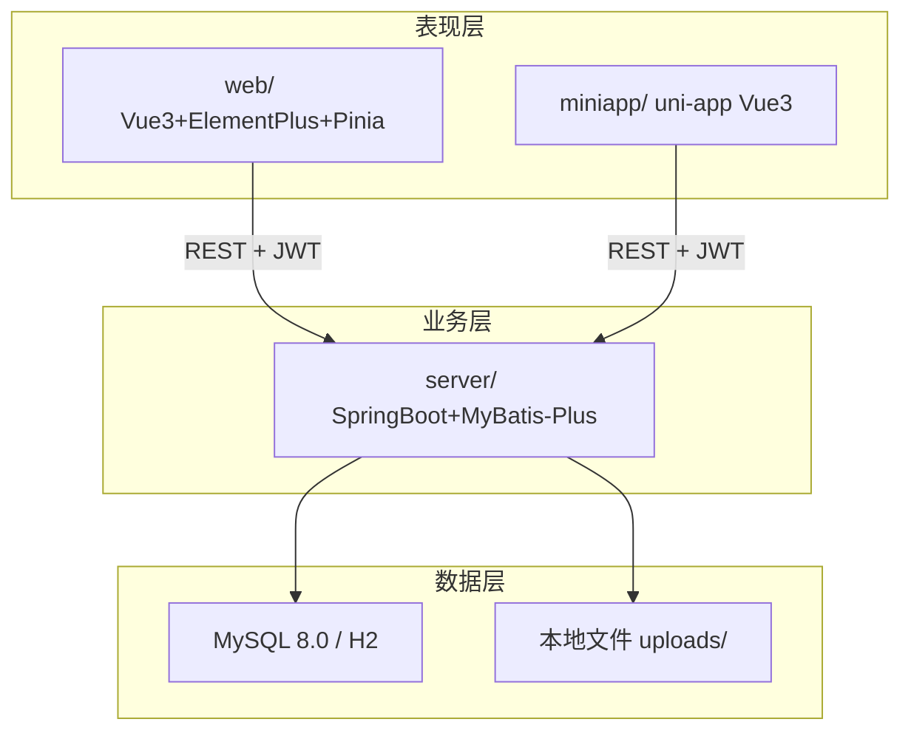
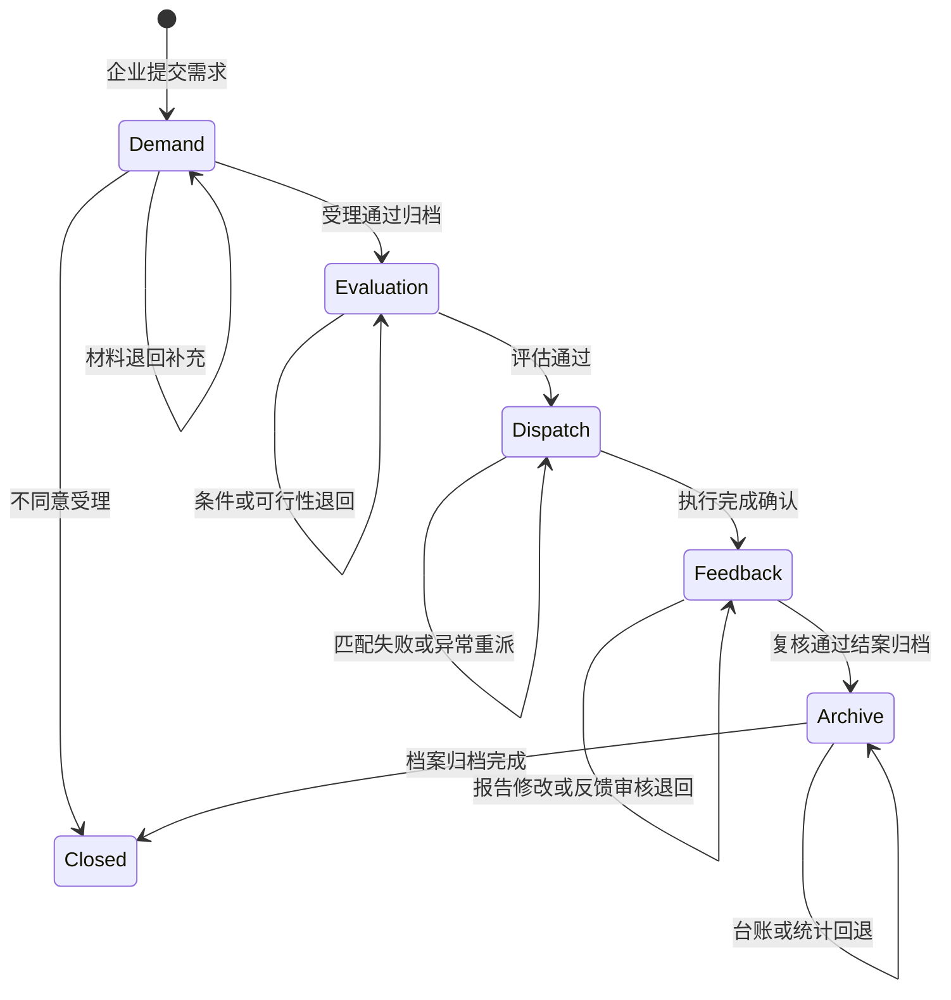
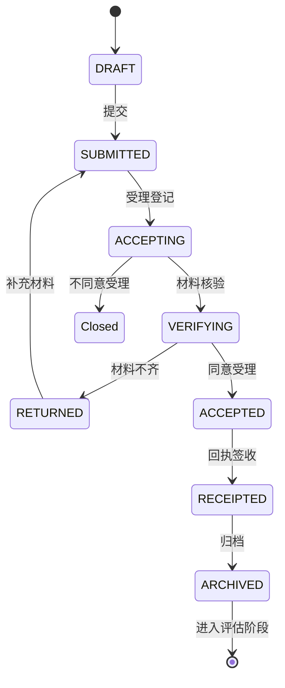

# 代码编写文档

**题目：** 广州生产力促进中心中试服务管理系统的设计与实现  
**编制日期：** 2026-06-26  
**文档定位：** 编码与缺陷修复 **唯一技术施工图**（执行层）  
**适用对象：** 编码角色、协作开发者、AI 编码助手  

> 本文档回答：**写代码按什么顺序做、文件放哪里、API/状态机怎么设计、怎么对照原型、测试出问题怎么修**。  
> 阶段节奏与质量门禁见 [`项目总体规划.md`](项目总体规划.md)；测试用例与验收见 [`系统测试文档.md`](系统测试文档.md)。

---

## 一、职责与原则

### 1.1 代码编写职责

| 职责 | 说明 |
|------|------|
| **按规划编码** | 严格遵循依据链，不擅自增删页面、改流程、换技术栈 |
| **三端对齐** | 后端 API → Web 页面 → 小程序页面，顺序不可颠倒 |
| **状态机完整** | 每个模块主路径 + 否支 ↺ 回退路径必须可运行 |
| **原型还原** | 字段名、按钮文案、跳转逻辑与 HTML 原型一致 |
| **缺陷修复** | 测试（单元 / E2E / 答辩彩排）发现的问题，按优先级闭环 |
| **追踪更新** | 完成页面后更新 [`页面清单.md`](原型图/页面清单.md) 实现状态 |

### 1.2 三条铁律

1. **先后端 API（含状态流转）→ 再 Web → 再 uni-app**  
2. **一活动一界面**：禁止把多个活动图节点合并到单页  
3. **改流程先改文档**：增删页面须先改开题方案 + 原型 + 页面清单 + 三份分工文档，再动代码  

### 1.3 当前阶段（2026-06-26）

| 阶段 | 状态 | 编码工作重点 |
|------|------|--------------|
| S0—S7 | ✅ 已完成 | 79 页 + 五模块 API 已闭合 |
| **S8 测试与论文** | 🔄 进行中 | **Bug 修复为主**，禁止新增业务功能 |

详见 [`分工/项目总体规划.md`](项目总体规划.md) §六、§七。

---

## 二、文档依据链（写代码前必读）

```
指南规范/开题方案.md（活动图、模块、实体）
        ↓
业务活动图/（5 张 PNG）
        ↓
原型图/（79 页 HTML + PNG + 页面元数据.yaml）
        ↓
原型图/页面清单.md（page_id → 路由 → API → 代码路径）
        ↓
分工/代码编写文档.md（本文：API、状态机、Checklist、前端规范）
        ↓
server/ + web/ + miniapp/（本仓库代码）
        ↓
分工/系统测试文档.md + 原型图/业务流程测试用例.md（验收与 Bug 复现）
```

### 2.1 查阅速查

| 我要… | 打开 |
|--------|------|
| 查某页路由、API、代码文件 | [`页面清单.md`](原型图/页面清单.md) |
| 查接口路径、状态变迁、子状态枚举 | 本文 §五—§七 |
| 对照界面字段与按钮 | `原型图/Web/.../*.html` 或 `原型图/小程序/.../*.html` |
| 查跳转关系 | [`页面元数据.yaml`](原型图/页面元数据.yaml) 的 `nav_to` |
| 查活动图主路径与 ↺ | [`原型图说明.md`](原型图/原型图说明.md) §3 |
| 复现 Bug / 验收 | [`业务流程测试用例.md`](原型图/业务流程测试用例.md) |
| 查阶段节奏、质量门禁 | [`项目总体规划.md`](项目总体规划.md) |
| 查测试用例、缺陷清单 | [`系统测试文档.md`](系统测试文档.md) |

---

## 三、技术架构与仓库结构

### 3.1 架构图



### 3.2 技术选型

| 层次 | 技术 | 版本建议 |
|------|------|----------|
| Web 前端 | Vue 3 + Vite + Element Plus + Pinia + Vue Router | Vue 3.4+ |
| 小程序 | uni-app（Vue 3 语法） | HBuilderX / CLI |
| 后端 | Spring Boot + MyBatis-Plus + Spring Security JWT | Boot 3.2 |
| 数据库 | MySQL 8.0（开发默认 H2 文件库） | — |
| 接口文档 | Knife4j（Swagger 3） | — |
| 图表 | ECharts 5 | 档案统计模块 |

### 3.3 环境约定

| 项 | 开发默认值 |
|----|------------|
| 后端端口 | `8080` |
| Web dev | `5173`，代理 `/api` → 8080 |
| 数据库 | H2 文件库 `data/zhongshi.mv.db`；可切换 MySQL `zhongshi_service` |
| JWT 过期 | 24h |
| 上传目录 | `server/uploads/` |

### 3.4 仓库总览

```
server/          Spring Boot 3 + MyBatis-Plus + JWT
web/             Vue 3 + Vite + Element Plus + Pinia
miniapp/         uni-app（Vue 3），仅 enterprise + technician
原型图/          原型与规划文档（只读参考，改流程时同步更新）
指南规范/        开题方案等（流程变更时先改此处）
```

### 3.5 后端 `server/`

```
src/main/java/com/gzpprod/center/
  common/                    # 统一响应、异常、JWT、状态枚举、SecurityUtils
  module/
    auth/                    # 登录、当前用户
    demand/                  # 中试需求管理
    evaluation/              # 中试评估管理
    dispatch/                # 中试调度管理
    feedback/                # 中试反馈管理
    archive/                 # 中试档案管理
    notification/            # 消息、待办
  每个 module 内：
    controller/              # REST 入口，@PreAuthorize 权限
    service/                 # 业务逻辑 + 状态机（@Transactional）
    mapper/                  # MyBatis-Plus Mapper
    entity/                  # 数据库实体
    dto/                     # 请求/响应对象

src/main/resources/
  application.yml
  db/schema.sql              # 建表
  db/seed.sql                # 演示数据 + 四角色账号

src/test/java/.../service/
  *ServiceTest.java          # 各模块状态流转单元测试
```

**命名约定：**

- 状态枚举放 `common/`，如 `DemandStatus`、`ProjectStage`
- 写操作必须 `@Transactional`，状态变更后调用 `NotificationService` 写待办
- 状态变迁须写 `workflow_log` 表
- Controller 路径与实施计划 §5 一致，如 `POST /api/projects/{id}/demand/submit`

### 3.6 Web 前端 `web/`

```
src/
  api/                       # 按模块封装，如 demand.ts、evaluation.ts
  api/http.ts                # axios 实例、拦截器、统一错误处理
  components/                  # StatusTag、ProjectStepBar、MaterialUpload 等
  layouts/                   # CenterLayout、EnterpriseLayout、TechnicianLayout
  router/
    index.ts                 # 守卫、角色分流
    center.ts / enterprise.ts / technician.ts
  views/
    common/                    # login、messages、profile
    center/dispatch/         # 调度员页面
    center/audit/            # 审核员页面
    enterprise/              # 企业门户
    technician/              # 技术人员门户
  types/                     # TypeScript 类型，与 DTO 对齐
```

**命名约定：**

- 视图文件：`{Action}View.vue`，如 `SubmitView.vue`、`WorkbenchView.vue`
- 路由路径与页面清单「路由」列一致
- 页面通过 `route.query.projectId` 或 `route.params` 接收项目 ID
- 列表+待办页复用首页 dashboard / todos API，「办理」按钮带 `projectId` 跳转

### 3.7 小程序 `miniapp/`

```
pages.json                   # 页面注册（路径与页面清单一致）
pages/
  login/login.vue
  enterprise/                # 企业 16 业务页 + home
  technician/                # 技术 6 业务页 + home
api/request.js               # 统一请求封装，Bearer token
utils/nav.js                 # 待办 → 页面路由映射
```

**命名约定：**

- 页面路径：`pages/{角色}/{模块}/{action}.vue`，如 `pages/enterprise/demand/submit.vue`
- API 与 Web 共用同一后端路径，禁止小程序单独 Mock
- 提交成功：`uni.showToast` + `navigateTo` 详情/进度页
- 仅企业端、技术端；**禁止**为调度员/审核员写小程序页

---

## 四、单页实现标准流程

> S0—S7 已全部完成；本节供补页、大改或答辩前自查使用。

### 4.1 实施顺序（单页）

| 步骤 | 层 | 动作 | 产出 |
|:--:|---|------|------|
| 1 | 文档 | 在页面清单找到 page_id、路由、API | 明确映射行 |
| 2 | 原型 | 打开对应 `.html`，记录字段、按钮、跳转 | 字段清单 |
| 3 | 后端 | schema（若新表）→ Service 状态方法 → Controller | Knife4j 可测 |
| 4 | 后端 | 补充 `*ServiceTest` 主路径 + ↺ 用例 | `mvn test` 通过 |
| 5 | Web | `api/*.ts` → `views/.../XxxView.vue` → router 注册 | 浏览器可点通 |
| 6 | 小程序 | `api/request.js` 方法 → `.vue` 页 → `pages.json` | 模拟器可点通 |
| 7 | 联调 | 走对应 TC 用例步骤 | 状态、待办正确 |
| 8 | 文档 | 页面清单「实现状态」→ 已完成 | 追踪同步 |

### 4.2 后端 Service 编写要点

以需求模块为范本（`DemandService.java`）：

1. **入口校验**：`SecurityUtils.requireRole(user, UserRole.xxx)`
2. **状态校验**：`requireStatus(project, ExpectedStatus)`，非法状态抛 `BusinessException`
3. **更新主表**：`trial_project.status`、`current_node`、`stage`（跨模块时）
4. **写业务表**：demand / evaluation / dispatch_task 等
5. **写流程日志**：`workflow_log`（from_node → to_node）
6. **写待办**：`notificationService.createTodo(...)`，目标角色可见
7. **↺ 回退**：明确回到哪个 sub_status，与活动图一致

### 4.3 Web 页面编写要点

1. **布局**：企业/技术/中心分别用对应 Layout
2. **公共组件**：
   - 详情/进度页嵌入 `ProjectStepBar`
   - 状态展示用 `StatusTag`
   - 审核页用通过/退回 + 意见框模式
   - 附件用 `MaterialUpload` → `POST /api/files/upload`
3. **侧栏菜单**：五模块名称字面一致——中试需求管理、中试评估管理、中试调度管理、中试反馈管理、中试档案管理
4. **路由守卫**：非本角色路由重定向首页或 403
5. **样式**：主色 `#1890FF`；成功 `#67C23A`；警告 `#E6A23C`；危险 `#F56C6C`

### 4.4 小程序页面编写要点

1. 请求走 `api/request.js`，token 存 `uni.setStorageSync('token')`
2. 首页待办点击走 `utils/nav.js` 映射到业务页
3. 字段与 Web 同源 API，UI 可简化但**业务字段不可少**
4. 从业务页返回首页时刷新 dashboard（`onShow` 拉取）

### 4.5 页面类型与必用能力

| 页面类型 | Web 组件/模式 | 典型 API |
|----------|---------------|----------|
| 列表+待办 | TodoTable / 首页卡片 + 「办理」 | `GET /api/common/todos` |
| 表单填报 | el-form + 暂存/提交 | `POST .../submit`、`.../draft` |
| 审核确认 | 只读详情 + 通过/退回 | `POST .../verify`、`.../audit` |
| 签收通知 | 确认按钮 + 单号展示 | `POST .../receipt` |
| 进度详情 | ProjectStepBar + 时间线 | `GET .../progress` |
| 统计图表 | ECharts | `GET /api/archive/cycle-stats` 等 |
| 归档 | 清单 + 确认 | `POST .../archive` |

---

## 五、核心领域模型

### 5.1 聚合根：中试项目 trial_project

五模块共享同一 `project_id`（项目编号如 `ZS-2026-001`）。

**项目主阶段 `stage`：**

| 枚举值 | 含义 |
|--------|------|
| `DEMAND` | 需求受理中 |
| `EVALUATION` | 评估中 |
| `DISPATCH` | 调度执行中 |
| `FEEDBACK` | 反馈复核中 |
| `ARCHIVE` | 档案统计中 |
| `CLOSED` | 已结案 |

### 5.2 数据表（对齐开题方案 §6.4）

| 表名 | 说明 | 关键字段 |
|------|------|----------|
| `sys_user` | 用户 | id, username, password, role, org_name, phone |
| `trial_project` | 中试项目主表 | id, project_no, title, enterprise_id, stage, status, current_node |
| `demand` | 需求 | project_id, content, pilot_type, expected_days |
| `demand_material` | 需求材料 | demand_id, file_url, material_type, version |
| `evaluation` | 评估 | project_id, condition_result, feasibility_result, conclusion |
| `resource` | 中试资源 | name, type, capacity, status |
| `dispatch_task` | 调度任务 | project_id, resource_id, technician_id, status |
| `task_progress` | 执行进度 | task_id, progress_pct, content, report_time |
| `feedback_report` | 试验报告 | project_id, task_id, content, file_url |
| `review_record` | 审核复核记录 | project_id, type, result, opinion, reviewer_id |
| `project_archive` | 项目档案 | project_id, ledger_json, brief_id |
| `service_brief` | 服务简报 | title, content, stats_json, audit_status |
| `notification` | 消息待办 | user_id, project_id, type, title, read_flag |
| `workflow_log` | 流程日志 | project_id, from_node, to_node, operator_id, remark |

### 5.3 项目状态机（主链）



### 5.4 模块内子状态（示例：需求 DEMAND）

| sub_status | 含义 | 对应活动节点 |
|------------|------|--------------|
| `DRAFT` | 草稿 | 需求信息确认 |
| `SUBMITTED` | 已提交待受理 | 中试需求提交 |
| `ACCEPTING` | 受理登记中 | 需求受理登记 |
| `VERIFYING` | 材料核验中 | 受理材料核验 |
| `RETURNED` | 已退回待补充 | 需求退回通知 → 材料补充 ↺ |
| `ACCEPTED` | 同意受理 | 受理结果通知 |
| `RECEIPTED` | 已签收 | 受理回执签收 |
| `ARCHIVED` | 需求段归档 | 受理信息归档 |

其他模块（评估/调度/反馈/档案）在 Service 层定义类似子状态枚举，**每个 ↺ 须可回到指定 sub_status**。

### 5.5 待办与跨泳道交接

- 跨泳道水平连线 = 写入 `notification` + 目标角色 `GET /api/common/todos` 可见。
- 原型「办理」按钮 = 打开对应路由并携带 `projectId`。
- 企业小程序提交 → 调度员 Web 待办 +1（同一 `project_id` 状态变更触发）。

### 5.6 需求模块子状态简图



---

## 六、原型 → 实现映射规则

### 6.1 映射字段说明

| 字段 | 约定 |
|------|------|
| page_id | 与 HTML 文件名一致，如 `Web-企业-需求-需求填报页` |
| Web 路由 | `/login`；`/center/dispatch/{module}/{action}`；`/center/audit/...`；`/enterprise/...`；`/technician/...` |
| uni-app 路径 | `pages/enterprise/{module}/{action}`；`pages/technician/...` |
| 页面类型 | 列表+待办 / 表单填报 / 审核确认 / 签收通知 / 进度详情 / 统计图表 / 归档 |
| API | `GET/POST /api/projects/{id}/{module}/{action}`，见 §七 |

**全量 79 行映射见 [`页面清单.md`](原型图/页面清单.md)**（含「路由」「主要 API」「实现状态」列）。

### 6.2 公共能力（须单独实现）

| 能力 | Web 路由 | API | 原型参考 |
|------|----------|-----|----------|
| 登录 | `/login` | `POST /api/auth/login` | Web-公共-登录页 |
| 当前用户 | — | `GET /api/auth/me` | — |
| 三门户首页 | `/center/home` 等 | `GET /api/common/dashboard` | 各公共首页 |
| 消息中心 | `/common/messages` | `GET /api/notifications` | 顶栏「消息」 |
| 个人中心 | `/common/profile` | `PUT /api/auth/profile` | 顶栏「个人中心」 |
| 五模块步骤条 | 嵌入详情页 | `GET /api/projects/{id}/progress` | 受理进度详情页等 |
| 附件上传 | 表单内 | `POST /api/files/upload` | 各表单页 |

### 6.3 侧栏菜单（Web 三套 Layout 共用模块名）

字面一致于功能模块图，**禁止改名**：

1. 中试需求管理  
2. 中试评估管理  
3. 中试调度管理  
4. 中试反馈管理  
5. 中试档案管理  

中心管理端：调度员可见调度相关子菜单 + 档案统计；审核员可见审核相关 + 台账；按 `sys_user.role` 过滤。

### 6.4 页面类型与组件对照

| 页面类型 | 必用组件 | 原型特征 |
|----------|----------|----------|
| 列表+待办 | TodoTable, StatusTag | 筛选栏、操作列「办理」 |
| 表单填报 | el-form, 附件上传 | 分组表单、暂存/提交 |
| 审核确认 | AuditForm, 只读详情 | 通过/退回、意见框 |
| 签收通知 | 确认按钮 + 单号 | 回执签收、派单通知 |
| 进度详情 | ProjectStepBar, 时间线 | 五模块全局进度 |
| 统计图表 | ECharts | 周期统计、成功率分析 |
| 归档 | 归档清单 + 确认 | 各模块 XX 归档页 |

---

## 七、API 设计框架

### 7.1 统一约定

- Base URL：`/api`
- 认证：`Authorization: Bearer {token}`
- 响应：`{ "code": 200, "message": "ok", "data": {} }`
- 分页：`page`, `size`；列表返回 `{ records, total }`
- 权限：Controller 方法标注 `@PreAuthorize("hasRole('DISPATCHER')")` 等

### 7.2 公共接口

| 方法 | 路径 | 角色 | 说明 |
|------|------|------|------|
| POST | `/api/auth/login` | 公开 | 登录，返回 token + role |
| GET | `/api/auth/me` | 已登录 | 当前用户信息 |
| PUT | `/api/auth/profile` | 已登录 | 修改密码等 |
| GET | `/api/common/dashboard` | 已登录 | 首页待办卡片统计 |
| GET | `/api/common/todos` | 已登录 | 待办列表（按角色过滤） |
| GET | `/api/notifications` | 已登录 | 消息列表 |
| PUT | `/api/notifications/{id}/read` | 已登录 | 标记已读 |
| POST | `/api/files/upload` | 已登录 | 附件上传 |
| GET | `/api/projects/{id}` | 相关角色 | 项目详情 |
| GET | `/api/projects/{id}/progress` | 相关角色 | 五模块步骤条数据 |

### 7.3 需求模块 `/api/projects/{id}/demand/*`

| 方法 | 路径 | 页面 page_id | 状态变迁 |
|------|------|--------------|----------|
| POST | `.../draft` | Web-企业-需求-需求预览确认页 | → DRAFT |
| POST | `.../submit` | Web-企业-需求-需求填报页 | DRAFT→SUBMITTED |
| GET | `.../todos` | Web-中心-调度-需求-需求受理工作台 | — |
| POST | `.../accept-register` | 需求受理工作台 | SUBMITTED→ACCEPTING |
| POST | `.../verify` | Web-中心-审核-需求-材料核验页 | 齐全/不齐分支 |
| POST | `.../reject` | Web-中心-调度-需求-退回意见页 | → RETURNED |
| POST | `.../supplement` | Web-企业-需求-材料补充页 | RETURNED→SUBMITTED ↺ |
| POST | `.../accept-result` | Web-中心-审核-需求-受理结果录入页 | → ACCEPTED / CLOSED |
| POST | `.../receipt` | Web-企业-需求-受理回执签收页 | → RECEIPTED |
| POST | `.../archive` | Web-中心-调度-需求-需求受理归档页 | → ARCHIVED, stage→EVALUATION |
| GET | `.../progress` | Web-企业-需求-受理进度详情页 | — |

### 7.4 评估模块 `/api/projects/{id}/evaluation/*`

| 方法 | 路径 | 关键页面 | 备注 |
|------|------|----------|------|
| POST | `.../precheck` | 评估前置核查页 | |
| POST | `.../condition` | 条件评估页 | 判断：是否具备条件 |
| POST | `.../rectify-notice` | 条件整改通知页 | 否支 |
| POST | `.../condition-supplement` | 条件材料补充页 | ↺ 前置核查 |
| POST | `.../resource` | 资源核定页 | |
| POST | `.../feasibility` | 可行性审查页 | 判断：可行性 |
| POST | `.../supplement` | 评估材料补充页 | ↺ 可行性审查 |
| POST | `.../conclusion` | 评估结论页 | |
| POST | `.../receipt` | 评估结论签收页 | |
| POST | `.../feedback` | 评估意见反馈页 | |
| POST | `.../archive` | 评估归档页 | stage→DISPATCH |
| GET | `.../detail` | 评估结论详情页 | |

### 7.5 调度模块 `/api/projects/{id}/dispatch/*` + `/api/tasks/*`

| 方法 | 路径 | 关键页面 | 备注 |
|------|------|----------|------|
| POST | `.../match` | 资源匹配页 | 失败 ↺ 匹配 |
| POST | `.../assign` | 任务派发页 | |
| POST | `.../assign-notice` | 派单通知页 | |
| POST | `/api/tasks/{id}/receive` | 任务接收页 | 技术人员 |
| POST | `/api/tasks/{id}/confirm` | 任务确认签收页 | |
| POST | `/api/tasks/{id}/progress` | 进度填报页 | |
| POST | `.../supervise` | 进度通报督办页 | |
| POST | `.../reassign` | 异常重派页 | ↺ 任务接收 |
| POST | `.../exec-confirm` | 执行结果确认页 | stage→FEEDBACK |
| GET | `.../progress` | 进度查看页 | 企业只读 |
| POST | `.../archive` | 调度归档页 | |

### 7.6 反馈模块 `/api/projects/{id}/feedback/*`

| 方法 | 路径 | 关键页面 | 备注 |
|------|------|----------|------|
| POST | `.../submit` | 结果提交页 | |
| POST | `.../validate` | 数据校验页 | |
| POST | `.../audit` | 报告审核页 | 不合格 ↺ 修改 |
| POST | `.../modify` | 结果修改页 | |
| POST | `.../review` | 复核确认页 | |
| POST | `.../report-archive` | 报告归档页 | |
| POST | `.../review-notice` | 复核结果通知页 | |
| POST | `.../review-feedback` | 复核意见反馈页 | |
| POST | `.../feedback-audit` | 反馈审核页 | 否 ↺ 意见反馈 |
| GET | `.../review-detail` | 复核结果详情页 | |
| POST | `.../case-archive` | 报告结案归档页 | stage→ARCHIVE |

### 7.7 档案模块 `/api/archive/*`

| 方法 | 路径 | 关键页面 | 备注 |
|------|------|----------|------|
| GET/PUT | `/api/archive/ledger` | 台账维护页 | ↺ 不完整 |
| POST | `.../projects/{id}/confirm` | 档案确认页 | |
| POST | `.../projects/{id}/collect` | 结案资料归集页 | |
| GET | `/api/archive/cycle-stats` | 周期统计页 | ↺ 不可用 |
| GET | `/api/archive/success-rate` | 成功率分析页 | |
| POST | `/api/archive/brief/generate` | 简报生成页 | |
| POST | `/api/archive/brief/audit` | 简报审核页 | |
| GET | `/api/archive/brief/{id}` | 简报查看页 | 企业 |
| POST | `.../projects/{id}/archive` | 档案归档页 | stage→CLOSED |

---

## 八、分模块开发 Checklist

### 8.1 S1 中试需求管理（图 3-1）

| 步骤 | 任务 | 产出 |
|------|------|------|
| 1 | 建表 `demand`, `demand_material`；扩展 `trial_project` | schema.sql |
| 2 | `DemandService` 状态机（含 RETURNED ↺ SUBMITTED） | 单元测试 ≥2 |
| 3 | `DemandController` + 权限 | Knife4j 文档 |
| 4 | Web 调度员 3 页 + 审核员 2 页 + 企业 5 页 | views/center, enterprise |
| 5 | uni-app 企业 5 页 | pages/enterprise/demand/* |
| 6 | 联调：材料不齐→退回→补充↺；同意受理→签收→归档 | 用例记录 |

### 8.2 S2 中试评估管理（图 3-2）

| 步骤 | 任务 |
|------|------|
| 1 | 表 `evaluation`；stage 进入 EVALUATION |
| 2 | 双判断：条件是否具备、技术是否可行；双 ↺ |
| 3 | Web 12 页 + 小程序 4 页（企业侧） |
| 4 | 验收：条件否 → 整改 → 补充 ↺；可行性否 → 评估材料补充 ↺ |

### 8.3 S3 中试调度管理（图 3-3）

| 步骤 | 任务 |
|------|------|
| 1 | 表 `resource`, `dispatch_task`, `task_progress` |
| 2 | 匹配失败 ↺；异常重派 ↺ 任务接收 |
| 3 | Web 11 页 + 小程序 4 页（技术 3 + 企业查看 1） |
| 4 | **里程碑：** 需求→评估→调度 三模块联调通过 |

### 8.4 S4 中试反馈管理（图 3-4）

| 步骤 | 任务 |
|------|------|
| 1 | 表 `feedback_report`, `review_record` |
| 2 | 报告审核 ↺ 修改；反馈审核 ↺ 复核意见反馈 |
| 3 | Web 11 页 + 小程序 4 页 |

### 8.5 S5 中试档案管理（图 3-5）

| 步骤 | 任务 |
|------|------|
| 1 | 表 `project_archive`, `service_brief` |
| 2 | 台账 ↺；统计 ↺；ECharts 周期/成功率 |
| 3 | Web 9 页 + 小程序 1 页（简报查看） |

### 8.6 S6—S8 收尾

- S6：`notification` 轮询、路由守卫、消息中心页。
- S7：uni-app 登录绑定、22 页与 Web API 对齐。
- S8：五条活动图主路径 + 各 1 条否支 E2E；更新 [`页面清单.md`](原型图/页面清单.md) 全部为「已完成」。

---

## 九、前端实现规范

### 9.1 Web 布局

- **CenterLayout：** 顶栏 + 左栏 220px + 主内容区 max-width 1440px。
- **EnterpriseLayout / TechnicianLayout：** 同上，菜单项按角色过滤。
- **主色：** `#1890FF`；成功 `#67C23A`；警告 `#E6A23C`；危险 `#F56C6C`。

### 9.2 公共组件

| 组件 | 职责 |
|------|------|
| `StatusTag` | draft / pending / processing / returned / completed / rejected |
| `ProjectStepBar` | 五模块步骤：需求受理→条件评估→资源调度→结果反馈→档案归集 |
| `TodoTable` | 待办列表 + 筛选 + 操作列 |
| `AuditForm` | 只读详情 + 审核意见 + 通过/退回 |
| `FileUpload` | 对接 `/api/files/upload` |

### 9.3 路由守卫

```text
登录后按 role 跳转：
  DISPATCHER / AUDITOR → /center/home
  ENTERPRISE           → /enterprise/home
  TECHNICIAN           → /technician/home
非本角色路由 → 403 或重定向首页
```

### 9.4 uni-app

- 仅 `enterprise`、`technician` 两套 pages。
- 请求封装与 Web 共用 baseURL、token 存储（`uni.setStorageSync`）。
- 提交成功：`uni.showToast` + `navigateTo` 详情页。

### 9.5 还原原型

实现每页时 **打开对应 `.html`** 对照：字段名、按钮文案、表格列、步骤条位置；允许 Element Plus 组件化，**不允许**改变业务字段与跳转逻辑。

### 9.6 演示账号

| 角色 | username | password | 登录后 |
|------|----------|----------|--------|
| 调度员 | dispatcher | 123456 | `/center/home` |
| 审核员 | auditor | 123456 | `/center/home` |
| 企业 | enterprise | 123456 | `/enterprise/home` |
| 技术人员 | technician | 123456 | `/technician/home` |

写入 `seed.sql`；**禁止**提交真实密码到公开仓库。

---

## 十、本地开发与联调

### 10.1 启动顺序

```bash
# 1. 后端（必须先起）
cd server && mvn spring-boot:run
# API: http://localhost:8080  文档: http://localhost:8080/doc.html

# 2. Web
cd web && npm install && npm run dev
# http://localhost:5173

# 3. 小程序（可选）
cd miniapp && npm install && npm run dev:mp-weixin
# 微信开发者工具勾选「不校验合法域名」
```

### 10.2 环境默认值

| 项 | 值 |
|----|-----|
| 后端端口 | 8080 |
| Web dev | 5173，代理 `/api` → 8080 |
| 数据库 | 开发默认 H2 文件库（`data/zhongshi.mv.db`） |
| 小程序 API | `http://127.0.0.1:8080/api`（真机改局域网 IP） |

### 10.3 联调检查清单

- [ ] Knife4j 调通目标 API，响应 `code=200`
- [ ] 数据库 `trial_project.status` / `stage` 与预期一致
- [ ] 目标角色首页待办出现/消失正确
- [ ] Web 与小程序同一 `projectId` 状态一致（TC-X2）
- [ ] ↺ 回退后原页面可再次进入并提交

---

## 十一、测试与缺陷修复

### 11.1 测试分层

| 类型 | 位置/工具 | 何时跑 |
|------|-----------|--------|
| 单元测试 | `server/src/test/.../*ServiceTest.java` | 改 Service 后必须 `mvn test` |
| 接口测试 | Knife4j / Apifox | 新 API 或改 DTO 后 |
| E2E 手工 | [`业务流程测试用例.md`](原型图/业务流程测试用例.md) 12 条 | S8 验收、答辩前 |
| 原型对照 | 页面清单 + HTML 原型 | 每页 UI 验收 |
| 答辩彩排 | [`答辩演示脚本.md`](原型图/答辩演示脚本.md) P0 主链 | ≥3 次 |

### 11.2 缺陷优先级（S8）

| 级别 | 定义 | 处理 |
|:--:|------|------|
| **P0** | 阻断流程、P0 主链走不通、待办不刷新、权限穿透、双端状态不一致 | **立即修复**，修完跑对应用例 |
| **P1** | 字段错误、按钮无响应、提示信息不对、样式严重偏离原型 | 答辩前修复 |
| **P2** | 美化、非关键提示、真机 OAuth、WebSocket | **不处理**，除非时间充裕 |

**S8 禁止**：新增业务页面、改活动图流程、替换技术栈、为调度员/审核员做小程序。

### 11.3 Bug 修复标准流程

```
1. 复现
   └─ 按 TC-XX 步骤或答辩脚本操作，记录 projectId、角色、当前 status/stage

2. 定位
   ├─ 前端：Network 看请求 URL、payload、响应 message
   ├─ 后端：日志 + Knife4j 单接口重放
   └─ 数据：H2 控制台查 trial_project、notification

3. 根因分类
   ├─ 状态机：Service 少分支 / 回退 status 错误 → 改 Service + 补单元测试
   ├─ 待办：Notification 未创建或角色过滤错误 → 改 NotificationService / todos 查询
   ├─ 前端：API 路径错、projectId 未传、跳转路由错 → 改 api/*.ts 或 vue 页
   └─ 权限：@PreAuthorize 或路由 guard 漏配 → 对齐本文 §七 角色表

4. 修复
   └─ 最小改动，不顺手重构无关代码

5. 验证
   ├─ mvn test（若动 Service）
   ├─ 原 TC 用例步骤再走一遍
   └─ 若动公共组件，抽测 1 条跨模块用例（如 TC-X1 片段）

6. 记录
   └─ 在业务流程测试用例.md 末尾「测试记录表」填写结果（S8 必填）
```

### 11.4 常见问题速查

| 现象 | 可能原因 | 处理 |
|------|----------|------|
| 小程序登录失败 | 后端未起、未勾选合法域名 | 见 [`miniapp/README.md`](miniapp/README.md) |
| 提交后待办不更新 | 未写 notification 或前端未刷新 | 查 Service + 首页 onMounted/onShow |
| 403 / 跳转首页 | 角色与路由不匹配 | 查 `@PreAuthorize`、router guard |
| 状态不允许操作 | 前置步骤未做或 ↺ 后 status 未回退 | 查 workflow_log，对照状态机 |
| Web 正常小程序异常 | API 路径或 BASE_URL 不一致 | 对齐 `request.js` 与 `api/*.ts` |
| 单元测试失败 | H2 测试库状态污染 | 看 `@BeforeEach` 是否重置数据 |

---

## 十二、代码风格与质量

### 12.1 通用

- **最小改动**：只修当前问题，不做无关重构
- **复用优先**：用已有组件、Service 方法、DTO，不复制粘贴新套
- **注释**：仅解释非显而易见的业务规则（如 ↺ 目标状态）
- **禁止**：硬编码真实密码入库、提交 `.env` 密钥、长期 Mock 不调后端

### 12.2 后端

- Java 17+，Lombok `@RequiredArgsConstructor` 注入
- 业务异常统一 `BusinessException`，由 `GlobalExceptionHandler` 转 JSON
- 枚举常量用 `.name()` 存库，禁止魔法字符串散落

### 12.3 Web

- `<script setup lang="ts">` + Composition API
- API 层与 views 分离；类型定义在 `types/`
- 用户反馈用 `ElMessage.success/warning/error`

### 12.4 小程序

- Options API 或 Composition API 均可，与同目录已有页面保持一致
- 错误提示与 Web 语义一致（成功/失败文案对照原型）

---

## 十三、禁止项清单（违反即偏离毕设范围）

与 [`项目总体规划.md`](项目总体规划.md) §四 一致：

1. 独立「用户管理」「系统设置」模块  
2. 调度员、审核员小程序版  
3. 跳过否支 / ↺ 回退路径  
4. 单页合并多个活动节点  
5. 长期前端 Mock、不联调后端  
6. 脱离原型擅自改业务字段或菜单名称  
7. S8 阶段新增业务功能（Bug 修复除外）  

---

## 十四、交付自检表

完成编码或修复后，逐项勾选：

### 14.1 单页/单接口

- [ ] 与页面清单路由、API 一致  
- [ ] 与原型 HTML 字段、按钮、跳转一致  
- [ ] 角色权限正确  
- [ ] 状态变更 + workflow_log + notification 完整  
- [ ] Web（及对应小程序页，若有）联调通过  

### 14.2 模块级

- [ ] 活动图主路径可走通  
- [ ] 至少 1 条 ↺ 否支可走通  
- [ ] `*ServiceTest` 通过  
- [ ] 页面清单状态已更新  

### 14.3 S8 发布前

- [ ] `cd server && mvn test` 全部通过  
- [ ] 12 条 E2E 用例已执行并记录  
- [ ] P0 主链彩排 ≥3 次  
- [ ] TC-X2 双端同步通过  
- [ ] README / 各端 README 启动步骤可照做  

---

## 十五、相关文档索引

| 文档 | 路径 | 用途 |
|------|------|------|
| 项目总体规划 | [`项目总体规划.md`](项目总体规划.md) | 阶段节奏、质量门禁、S8 缺口 |
| 系统测试文档 | [`系统测试文档.md`](系统测试文档.md) | 测试用例、缺陷清单、验收标准 |
| 页面清单 | [`页面清单.md`](原型图/页面清单.md) | 79 页映射与实现追踪 |
| 业务流程测试用例 | [`业务流程测试用例.md`](原型图/业务流程测试用例.md) | E2E 步骤与测试记录 |
| 答辩演示脚本 | [`答辩演示脚本.md`](原型图/答辩演示脚本.md) | 答辩操作顺序 |
| 后端 README | [`server/README.md`](../server/README.md) | 启动、H2/MySQL |
| Web README | [`web/README.md`](../web/README.md) | 前端启动 |
| 小程序 README | [`miniapp/README.md`](../miniapp/README.md) | 微信开发者工具配置 |

---

**修订记录**

| 日期 | 版本 | 说明 |
|------|------|------|
| 2026-06-26 | v1.0 | 初版：编码流程、三端规范、S8 缺陷修复流程 |
| 2026-06-26 | v2.0 | 吸收原《系统开发实施计划》技术施工图（领域模型、API、Checklist、前端规范） |
