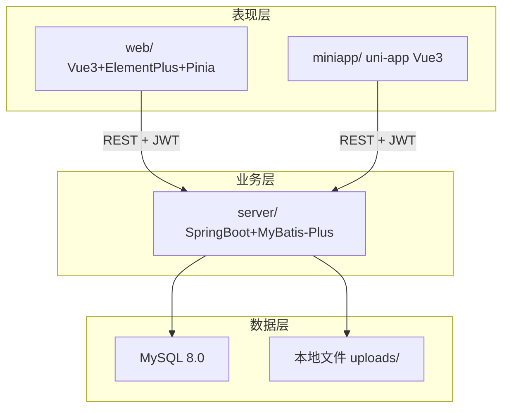
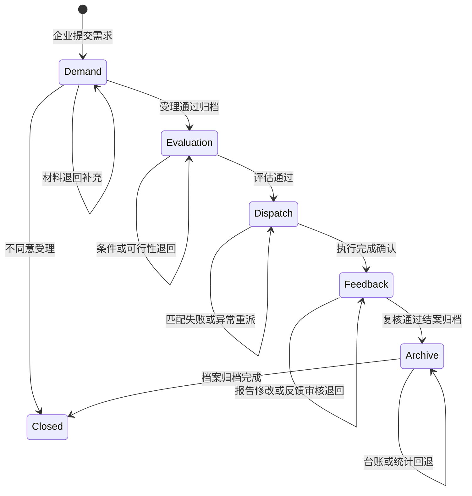
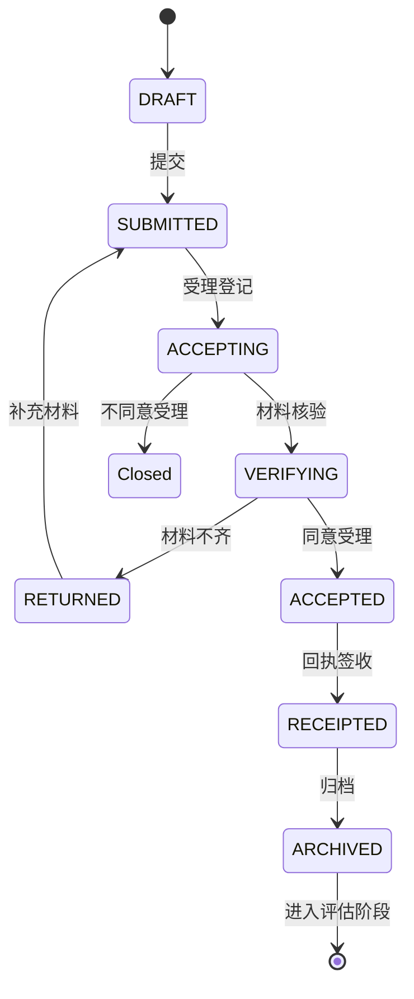

# 系统开发实施计划

**题目：** 广州生产力促进中心中试服务管理系统的设计与实现  
**编制日期：** 2026-06-23  
**文档定位：** 编码阶段 **唯一执行依据**（总施工图）  
**前置成果：** 原型图 79 页（Web 57 + 小程序 22）、功能模块图 1—5—4、业务活动图 5 张

> 后续所有页面实现、接口设计、数据库表、阶段验收 **必须以本文档 + 原型为准**。  
> 增删页面或改流程须 **先改** `指南规范/开题方案.md` §5.6/§5.11 **与原型**，再同步本文档。

---

## 一、总则与约束

### 1.1 唯一依据链

```
业务活动图（5 张）
    ↓ 一活动一界面
原型 page_id（79 页，见 页面清单.md）
    ↓ 映射
Vue / uni-app 路由
    ↓ 调用
REST API（JWT）
    ↓ 持久化
MySQL 数据表 + 状态机
```

### 1.2 强制引用文档

| 文档 | 用途 |
|------|------|
| [`页面清单.md`](页面清单.md) | 79 页索引、路由、API、实现状态追踪 |
| [`页面元数据.yaml`](页面元数据.yaml) | page_id、活动节点、跳转 nav_to |
| [`原型图说明.md`](原型图说明.md) | 五模块关键跳转与自检结果 |
| [`指南规范/开题方案.md`](../指南规范/开题方案.md) §5.6、§5.11、§6.3、§6.4 | 活动图、模块清单、实体概要 |
| [`指南规范/原型图生成规范.md`](../指南规范/原型图生成规范.md) §7 | 页面类型、状态标签 |

### 1.3 禁止项

1. 添加与模块图无关的业务菜单（如独立「用户管理」「系统设置」模块）。
2. 跳过活动图 **否支 / ↺ 回退**（退回、补充、重派、修改须可再次进入对应页）。
3. 为调度员、审核员开发小程序版。
4. 长期前端 Mock 不联调后端。
5. 脱离原型合并多活动于单页。

### 1.4 编码顺序铁律

**先后端 API（含状态流转）→ 再 Web 页面 → 再 uni-app 对应页。**

---

## 二、技术架构与仓库结构

### 2.1 架构图



### 2.2 技术选型

| 层次 | 技术 | 版本建议 |
|------|------|----------|
| Web 前端 | Vue 3 + Vite + Element Plus + Pinia + Vue Router | Vue 3.4+ |
| 小程序 | uni-app（Vue 3 语法） | HBuilderX / CLI |
| 后端 | Spring Boot + MyBatis-Plus + Spring Security JWT | Boot 3.2 / 2.7 |
| 数据库 | MySQL | 8.0 |
| 接口文档 | Knife4j（Swagger 3） | — |
| 图表 | ECharts 5 | 档案统计模块 |

### 2.3 仓库目录（根目录新建）

```
server/
  pom.xml
  src/main/java/com/gzpprod/center/
    CenterApplication.java
    common/          # 统一响应、异常、JWT、文件上传
    module/
      auth/          # 登录、当前用户
      demand/        # 中试需求管理
      evaluation/    # 中试评估管理
      dispatch/      # 中试调度管理
      feedback/      # 中试反馈管理
      archive/       # 中试档案管理
      notification/  # 消息、待办
  src/main/resources/
    application.yml
    mapper/
    db/schema.sql    # 建表
    db/seed.sql      # 演示数据 + 四角色账号

web/
  package.json
  src/
    api/             # 按模块封装 axios
    components/      # StatusTag, ProjectStepBar, TodoTable, AuditForm
    layouts/         # CenterLayout, EnterpriseLayout, TechnicianLayout
    router/
      index.ts
      center.ts
      enterprise.ts
      technician.ts
    views/
      common/        # login, messages, profile
      center/        # dispatch/*, audit/*
      enterprise/    # demand/*, evaluation/*, ...
      technician/    # dispatch/*, feedback/*

miniapp/
  pages.json
  pages/
    enterprise/      # 企业 16 页
    technician/      # 技术 6 页
  api/               # 与 web 共用接口约定
  components/

原型图/              # 已有；含本计划、页面清单
指南规范/            # 开题方案等
```

### 2.4 环境约定

| 项 | 开发默认值 |
|----|------------|
| 后端端口 | `8080` |
| Web  dev | `5173`，代理 `/api` → 8080 |
| 数据库 | `jdbc:mysql://localhost:3306/zhongshi_service` |
| JWT 过期 | 24h |
| 上传目录 | `server/uploads/` |

---

## 三、核心领域模型

### 3.1 聚合根：中试项目 trial_project

五模块共享同一 `project_id`（项目编号如 `ZS-2026-001`）。

**项目主阶段 `stage`：**

| 枚举值 | 含义 |
|--------|------|
| `DEMAND` | 需求受理中 |
| `EVALUATION` | 评估中 |
| `DISPATCH` | 调度执行中 |
| `FEEDBACK` | 反馈复核中 |
| `ARCHIVE` | 档案统计中 |
| `CLOSED` | 已结案 |

### 3.2 数据表（对齐开题方案 §6.4）

| 表名 | 说明 | 关键字段 |
|------|------|----------|
| `sys_user` | 用户 | id, username, password, role, org_name, phone |
| `trial_project` | 中试项目主表 | id, project_no, title, enterprise_id, stage, status, current_node |
| `demand` | 需求 | project_id, content, pilot_type, expected_days |
| `demand_material` | 需求材料 | demand_id, file_url, material_type, version |
| `evaluation` | 评估 | project_id, condition_result, feasibility_result, conclusion |
| `resource` | 中试资源 | name, type, capacity, status |
| `dispatch_task` | 调度任务 | project_id, resource_id, technician_id, status |
| `task_progress` | 执行进度 | task_id, progress_pct, content, report_time |
| `feedback_report` | 试验报告 | project_id, task_id, content, file_url |
| `review_record` | 审核复核记录 | project_id, type, result, opinion, reviewer_id |
| `project_archive` | 项目档案 | project_id, ledger_json, brief_id |
| `service_brief` | 服务简报 | title, content, stats_json, audit_status |
| `notification` | 消息待办 | user_id, project_id, type, title, read_flag |
| `workflow_log` | 流程日志 | project_id, from_node, to_node, operator_id, remark |

### 3.3 项目状态机（主链）



### 3.4 模块内子状态（示例：需求 DEMAND）

| sub_status | 含义 | 对应活动节点 |
|------------|------|--------------|
| `DRAFT` | 草稿 | 需求信息确认 |
| `SUBMITTED` | 已提交待受理 | 中试需求提交 |
| `ACCEPTING` | 受理登记中 | 需求受理登记 |
| `VERIFYING` | 材料核验中 | 受理材料核验 |
| `RETURNED` | 已退回待补充 | 需求退回通知 → 材料补充 ↺ |
| `ACCEPTED` | 同意受理 | 受理结果通知 |
| `RECEIPTED` | 已签收 | 受理回执签收 |
| `ARCHIVED` | 需求段归档 | 受理信息归档 |

其他模块（评估/调度/反馈/档案）在 Service 层定义类似子状态枚举，**每个 ↺ 须可回到指定 sub_status**。

### 3.5 待办与跨泳道交接

- 跨泳道水平连线 = 写入 `notification` + 目标角色 `GET /api/common/todos` 可见。
- 原型「办理」按钮 = 打开对应路由并携带 `projectId`。
- 企业小程序提交 → 调度员 Web 待办 +1（同一 `project_id` 状态变更触发）。

---

## 四、原型 → 实现映射规则

### 4.1 映射字段说明

| 字段 | 约定 |
|------|------|
| page_id | 与 HTML 文件名一致，如 `Web-企业-需求-需求填报页` |
| Web 路由 | `/login`；`/center/dispatch/{module}/{action}`；`/center/audit/...`；`/enterprise/...`；`/technician/...` |
| uni-app 路径 | `pages/enterprise/{module}/{action}`；`pages/technician/...` |
| 页面类型 | 列表+待办 / 表单填报 / 审核确认 / 签收通知 / 进度详情 / 统计图表 / 归档 |
| API | `GET/POST /api/projects/{id}/{module}/{action}`，见 §5 |

**全量 79 行映射见 [`页面清单.md`](页面清单.md)**（含「路由」「主要 API」「实现状态」列）。

### 4.2 公共能力（须单独实现）

| 能力 | Web 路由 | API | 原型参考 |
|------|----------|-----|----------|
| 登录 | `/login` | `POST /api/auth/login` | Web-公共-登录页 |
| 当前用户 | — | `GET /api/auth/me` | — |
| 三门户首页 | `/center/home` 等 | `GET /api/common/dashboard` | 各公共首页 |
| 消息中心 | `/common/messages` | `GET /api/notifications` | 顶栏「消息」 |
| 个人中心 | `/common/profile` | `PUT /api/auth/profile` | 顶栏「个人中心」 |
| 五模块步骤条 | 嵌入详情页 | `GET /api/projects/{id}/progress` | 受理进度详情页等 |
| 附件上传 | 表单内 | `POST /api/files/upload` | 各表单页 |

### 4.3 侧栏菜单（Web 三套 Layout 共用模块名）

字面一致于功能模块图，**禁止改名**：

1. 中试需求管理  
2. 中试评估管理  
3. 中试调度管理  
4. 中试反馈管理  
5. 中试档案管理  

中心管理端：调度员可见调度相关子菜单 + 档案统计；审核员可见审核相关 + 台账；按 `sys_user.role` 过滤。

### 4.4 页面类型与组件对照

| 页面类型 | 必用组件 | 原型特征 |
|----------|----------|----------|
| 列表+待办 | TodoTable, StatusTag | 筛选栏、操作列「办理」 |
| 表单填报 | el-form, 附件上传 | 分组表单、暂存/提交 |
| 审核确认 | AuditForm, 只读详情 | 通过/退回、意见框 |
| 签收通知 | 确认按钮 + 单号 | 回执签收、派单通知 |
| 进度详情 | ProjectStepBar, 时间线 | 五模块全局进度 |
| 统计图表 | ECharts | 周期统计、成功率分析 |
| 归档 | 归档清单 + 确认 | 各模块 XX 归档页 |

---

## 五、API 设计框架

### 5.1 统一约定

- Base URL：`/api`
- 认证：`Authorization: Bearer {token}`
- 响应：`{ "code": 200, "message": "ok", "data": {} }`
- 分页：`page`, `size`；列表返回 `{ records, total }`
- 权限：Controller 方法标注 `@PreAuthorize("hasRole('DISPATCHER')")` 等

### 5.2 公共接口

| 方法 | 路径 | 角色 | 说明 |
|------|------|------|------|
| POST | `/api/auth/login` | 公开 | 登录，返回 token + role |
| GET | `/api/auth/me` | 已登录 | 当前用户信息 |
| PUT | `/api/auth/profile` | 已登录 | 修改密码等 |
| GET | `/api/common/dashboard` | 已登录 | 首页待办卡片统计 |
| GET | `/api/common/todos` | 已登录 | 待办列表（按角色过滤） |
| GET | `/api/notifications` | 已登录 | 消息列表 |
| PUT | `/api/notifications/{id}/read` | 已登录 | 标记已读 |
| POST | `/api/files/upload` | 已登录 | 附件上传 |
| GET | `/api/projects/{id}` | 相关角色 | 项目详情 |
| GET | `/api/projects/{id}/progress` | 相关角色 | 五模块步骤条数据 |

### 5.3 需求模块 `/api/projects/{id}/demand/*`

| 方法 | 路径 | 页面 page_id | 状态变迁 |
|------|------|--------------|----------|
| POST | `.../draft` | Web-企业-需求-需求预览确认页 | → DRAFT |
| POST | `.../submit` | Web-企业-需求-需求填报页 | DRAFT→SUBMITTED |
| GET | `.../todos` | Web-中心-调度-需求-需求受理工作台 | — |
| POST | `.../accept-register` | 需求受理工作台 | SUBMITTED→ACCEPTING |
| POST | `.../verify` | Web-中心-审核-需求-材料核验页 | 齐全/不齐分支 |
| POST | `.../reject` | Web-中心-调度-需求-退回意见页 | → RETURNED |
| POST | `.../supplement` | Web-企业-需求-材料补充页 | RETURNED→SUBMITTED ↺ |
| POST | `.../accept-result` | Web-中心-审核-需求-受理结果录入页 | → ACCEPTED / CLOSED |
| POST | `.../receipt` | Web-企业-需求-受理回执签收页 | → RECEIPTED |
| POST | `.../archive` | Web-中心-调度-需求-需求受理归档页 | → ARCHIVED, stage→EVALUATION |
| GET | `.../progress` | Web-企业-需求-受理进度详情页 | — |

### 5.4 评估模块 `/api/projects/{id}/evaluation/*`

| 方法 | 路径 | 关键页面 | 备注 |
|------|------|----------|------|
| POST | `.../precheck` | 评估前置核查页 | |
| POST | `.../condition` | 条件评估页 | 判断：是否具备条件 |
| POST | `.../rectify-notice` | 条件整改通知页 | 否支 |
| POST | `.../condition-supplement` | 条件材料补充页 | ↺ 前置核查 |
| POST | `.../resource` | 资源核定页 | |
| POST | `.../feasibility` | 可行性审查页 | 判断：可行性 |
| POST | `.../supplement` | 评估材料补充页 | ↺ 可行性审查 |
| POST | `.../conclusion` | 评估结论页 | |
| POST | `.../receipt` | 评估结论签收页 | |
| POST | `.../feedback` | 评估意见反馈页 | |
| POST | `.../archive` | 评估归档页 | stage→DISPATCH |
| GET | `.../detail` | 评估结论详情页 | |

### 5.5 调度模块 `/api/projects/{id}/dispatch/*` + `/api/tasks/*`

| 方法 | 路径 | 关键页面 | 备注 |
|------|------|----------|------|
| POST | `.../match` | 资源匹配页 | 失败 ↺ 匹配 |
| POST | `.../assign` | 任务派发页 | |
| POST | `.../assign-notice` | 派单通知页 | |
| POST | `/api/tasks/{id}/receive` | 任务接收页 | 技术人员 |
| POST | `/api/tasks/{id}/confirm` | 任务确认签收页 | |
| POST | `/api/tasks/{id}/progress` | 进度填报页 | |
| POST | `.../supervise` | 进度通报督办页 | |
| POST | `.../reassign` | 异常重派页 | ↺ 任务接收 |
| POST | `.../exec-confirm` | 执行结果确认页 | stage→FEEDBACK |
| GET | `.../progress` | 进度查看页 | 企业只读 |
| POST | `.../archive` | 调度归档页 | |

### 5.6 反馈模块 `/api/projects/{id}/feedback/*`

| 方法 | 路径 | 关键页面 | 备注 |
|------|------|----------|------|
| POST | `.../submit` | 结果提交页 | |
| POST | `.../validate` | 数据校验页 | |
| POST | `.../audit` | 报告审核页 | 不合格 ↺ 修改 |
| POST | `.../modify` | 结果修改页 | |
| POST | `.../review` | 复核确认页 | |
| POST | `.../report-archive` | 报告归档页 | |
| POST | `.../review-notice` | 复核结果通知页 | |
| POST | `.../review-feedback` | 复核意见反馈页 | |
| POST | `.../feedback-audit` | 反馈审核页 | 否 ↺ 意见反馈 |
| GET | `.../review-detail` | 复核结果详情页 | |
| POST | `.../case-archive` | 报告结案归档页 | stage→ARCHIVE |

### 5.7 档案模块 `/api/archive/*`

| 方法 | 路径 | 关键页面 | 备注 |
|------|------|----------|------|
| GET/PUT | `/api/archive/ledger` | 台账维护页 | ↺ 不完整 |
| POST | `.../projects/{id}/confirm` | 档案确认页 | |
| POST | `.../projects/{id}/collect` | 结案资料归集页 | |
| GET | `/api/archive/cycle-stats` | 周期统计页 | ↺ 不可用 |
| GET | `/api/archive/success-rate` | 成功率分析页 | |
| POST | `/api/archive/brief/generate` | 简报生成页 | |
| POST | `/api/archive/brief/audit` | 简报审核页 | |
| GET | `/api/archive/brief/{id}` | 简报查看页 | 企业 |
| POST | `.../projects/{id}/archive` | 档案归档页 | stage→CLOSED |

---

## 六、分阶段实施计划（16 周）

与 [`开题方案.md`](../指南规范/开题方案.md) §九 对齐。

| 阶段 | 周次 | 目标 | 验收标准 | 更新页面清单 |
|------|------|------|----------|--------------|
| **S0 工程初始化** | 第5周前半 | 三端脚手架、DB、登录 | 四角色登录进对应首页 | 序号 1—6 → **S0已完成** |
| **S1 需求模块** | 第5—6周 | 图3-1 全部 Web+小程序 | D1 闭环可走通 | 序号 7—21 |
| **S2 评估模块** | 第6—7周 | 图3-2 | D2 双循环 | 序号 22—38 |
| **S3 调度模块** | 第7—8周 | 图3-3 | **可演示主链** 需求→评估→调度 | 序号 39—53 |
| **S4 反馈模块** | 第8—9周 | 图3-4 | D4 双审核 | 序号 54—69 |
| **S5 档案模块** | 第9—10周 | 图3-5 | D5 + 图表 | 序号 70—79 |
| **S6 Web 联调收尾** | 第10周 | 权限、消息、57 Web 页 | 路由全覆盖 | 全部 Web → 已完成 |
| **S7 小程序** | 第11—12周 | 22 页 uni-app | 与 Web 状态同步 | 小程序列 → 已完成 |
| **S8 测试与论文** | 第13—16周 | E2E、Bug、论文 | 五条主线测试通过 | — |

### 6.1 P0 可演示主链（优先打通）

```
企业 需求填报 → 调度 受理工作台 → 评估 条件评估 → 调度 任务派发
→ 技术 进度填报 → 技术 结果提交 → 审核 报告审核 → 调度 周期统计
```

档案模块其余页面可在 S5 第二批完善 UI 细节，但 **状态机须完整**。

---

## 七、分模块开发 Checklist

### 7.1 S1 中试需求管理（图 3-1）

| 步骤 | 任务 | 产出 |
|------|------|------|
| 1 | 建表 `demand`, `demand_material`；扩展 `trial_project` | schema.sql |
| 2 | `DemandService` 状态机（含 RETURNED ↺ SUBMITTED） | 单元测试 ≥2 |
| 3 | `DemandController` + 权限 | Knife4j 文档 |
| 4 | Web 调度员 3 页 + 审核员 2 页 + 企业 5 页 | views/center, enterprise |
| 5 | uni-app 企业 5 页 | pages/enterprise/demand/* |
| 6 | 联调：材料不齐→退回→补充↺；同意受理→签收→归档 | 用例记录 |

**对照原型 HTML：** `原型图/Web/02-企业门户/Web-企业-需求-*.html` 等。

### 7.2 S2 中试评估管理（图 3-2）

| 步骤 | 任务 |
|------|------|
| 1 | 表 `evaluation`；stage 进入 EVALUATION |
| 2 | 双判断：条件是否具备、技术是否可行；双 ↺ |
| 3 | Web 12 页 + 小程序 4 页（企业侧） |
| 4 | 验收：条件否 → 整改 → 补充 ↺；可行性否 → 评估材料补充 ↺ |

### 7.3 S3 中试调度管理（图 3-3）

| 步骤 | 任务 |
|------|------|
| 1 | 表 `resource`, `dispatch_task`, `task_progress` |
| 2 | 匹配失败 ↺；异常重派 ↺ 任务接收 |
| 3 | Web 11 页 + 小程序 4 页（技术 3 + 企业查看 1） |
| 4 | **里程碑：** 需求→评估→调度 三模块联调通过 |

### 7.4 S4 中试反馈管理（图 3-4）

| 步骤 | 任务 |
|------|------|
| 1 | 表 `feedback_report`, `review_record` |
| 2 | 报告审核 ↺ 修改；反馈审核 ↺ 复核意见反馈 |
| 3 | Web 11 页 + 小程序 4 页 |

### 7.5 S5 中试档案管理（图 3-5）

| 步骤 | 任务 |
|------|------|
| 1 | 表 `project_archive`, `service_brief` |
| 2 | 台账 ↺；统计 ↺；ECharts 周期/成功率 |
| 3 | Web 9 页 + 小程序 1 页（简报查看） |

### 7.6 S6—S8 收尾

- S6：`notification` 轮询、路由守卫、消息中心页。
- S7：uni-app 登录绑定、22 页与 Web API 对齐。
- S8：五条活动图主路径 + 各 1 条否支 E2E；更新 [`页面清单.md`](页面清单.md) 全部为「已完成」。

---

## 八、前端实现规范

### 8.1 Web 布局

- **CenterLayout：** 顶栏 + 左栏 220px + 主内容区 max-width 1440px。
- **EnterpriseLayout / TechnicianLayout：** 同上，菜单项按角色过滤。
- **主色：** `#1890FF`；成功 `#67C23A`；警告 `#E6A23C`；危险 `#F56C6C`。

### 8.2 公共组件

| 组件 | 职责 |
|------|------|
| `StatusTag` | draft / pending / processing / returned / completed / rejected |
| `ProjectStepBar` | 五模块步骤：需求受理→条件评估→资源调度→结果反馈→档案归集 |
| `TodoTable` | 待办列表 + 筛选 + 操作列 |
| `AuditForm` | 只读详情 + 审核意见 + 通过/退回 |
| `FileUpload` | 对接 `/api/files/upload` |

### 8.3 路由守卫

```text
登录后按 role 跳转：
  DISPATCHER / AUDITOR → /center/home
  ENTERPRISE           → /enterprise/home
  TECHNICIAN           → /technician/home
非本角色路由 → 403 或重定向首页
```

### 8.4 uni-app

- 仅 `enterprise`、`technician` 两套 pages。
- 请求封装与 Web 共用 baseURL、token 存储（`uni.setStorageSync`）。
- 提交成功：`uni.showToast` + `navigateTo` 详情页。

### 8.5 还原原型

实现每页时 **打开对应 `.html`** 对照：字段名、按钮文案、表格列、步骤条位置；允许 Element Plus 组件化，**不允许**改变业务字段与跳转逻辑。

---

## 九、测试策略

| 类型 | 范围 | 工具 |
|------|------|------|
| 单元测试 | 各模块 Service 状态流转；每个 ↺ ≥1 用例 | JUnit 5 |
| 接口测试 | §5 全部 API | Apifox / Postman 集合 |
| 业务流程测试 | 5 条活动图主路径 + 否支 | 手工 + 测试用例表 |
| 原型对照 | 79 页字段与按钮 | 页面清单勾选 |
| 双端同步 | 小程序提交 → Web 待办 | 联调用例 |

**流程测试用例来源：** [`原型图说明.md`](原型图说明.md) §3 关键跳转。

---

## 十、风险与简化策略

| 风险 | 策略 |
|------|------|
| 16 周工作量 | 严格按 S0—S5 顺序；P0 主链优先 |
| 微信真机登录 | 毕设用账号密码 + 绑定 openid 字段；真机 P2 |
| 消息实时性 | 轮询 30s + 站内 notification 表；WebSocket P2 |
| 附件存储 | 本地 `uploads/`；生产可换 MinIO |
| 统计真实性 | seed.sql 演示数据 + ECharts 基础图 |

---

## 十一、交付物清单

| 序号 | 交付物 | 位置 |
|------|--------|------|
| 1 | 后端可运行工程 | `server/` |
| 2 | Web 可运行工程 | `web/` |
| 3 | uni-app 工程 | `miniapp/` |
| 4 | 建表与种子数据 | `server/src/main/resources/db/` |
| 5 | 接口文档 | Knife4j `/doc.html` |
| 6 | 实现追踪 | [`页面清单.md`](页面清单.md) |
| 7 | 本计划 | [`系统开发实施计划.md`](系统开发实施计划.md) |
| 8 | 论文素材 | 第4章架构、第5章截图、第6章测试 |

---

## 十二、附录

### 附录 A 四角色演示账号

| 角色 | username | password | 登录后路由 |
|------|----------|----------|------------|
| 中试调度员 | dispatcher | 123456 | /center/home |
| 中试审核员 | auditor | 123456 | /center/home |
| 企业项目负责人 | enterprise | 123456 | /enterprise/home |
| 中试技术人员 | technician | 123456 | /technician/home |

写入 `seed.sql`；**禁止**提交真实密码到公开仓库（本地开发即可）。

### 附录 B page_id → 路由 → API

全量 79 行见 **[`页面清单.md`](页面清单.md)**。实现时每完成一页，将该行「实现状态」改为「已完成」。

### 附录 C 需求模块子状态简图



### 附录 D 每周任务勾选表

| 周 | 阶段 | 关键任务 | □ |
|----|------|----------|---|
| 5上 | S0 | server/web/miniapp 脚手架；schema.sql；登录 API | |
| 5下 | S1 | 需求 Service + Web 企业 5 页 | |
| 6 | S1+S2 | 需求闭环；评估 API 启动 | |
| 7 | S2+S3 | 评估闭环；调度 API + 技术页 | |
| 8 | S3+S4 | **主链演示**；反馈 API | |
| 9 | S4+S5 | 反馈闭环；档案 API + 图表 | |
| 10 | S5+S6 | 档案闭环；Web 57 页收尾、消息 | |
| 11 | S7 | uni-app 企业端 | |
| 12 | S7 | uni-app 技术端；双端联调 | |
| 13—14 | S8 | E2E 测试、Bug 修复 | |
| 15—16 | S8 | 论文撰写定稿 | |

---

**修订记录**

| 日期 | 版本 | 说明 |
|------|------|------|
| 2026-06-23 | v1.0 | 依据 79 页原型、开题方案、页面清单初版 |
| 2026-06-23 | v1.1 | S0 完成：server/web/miniapp 脚手架、登录、四角色首页 |
